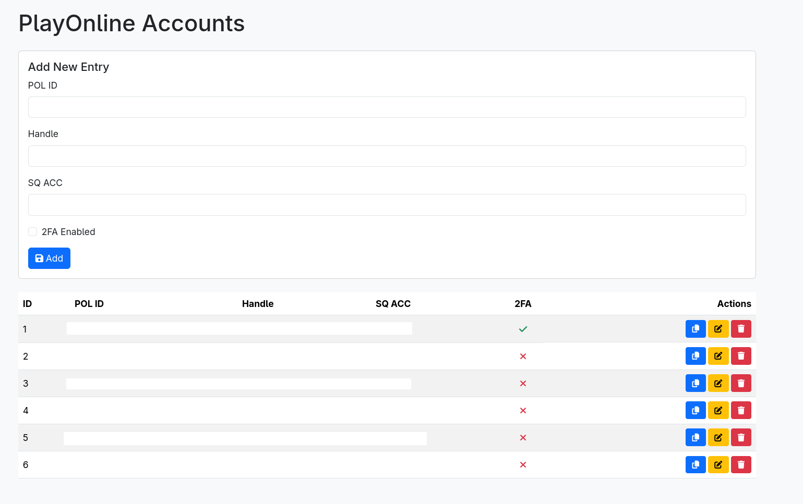

# polManager
Pol Manager is a simple Account manager for Playonline Accounts for multiboxers. 

It's based on Node Express and Postgres for database and backend service. 

The webpage interface is built using Vue3. All information is kept locally in your docker container. 

No passwords are stored.

## Requirements

- Install Docker and Docker Compose for your OS

## Install

- Download or clone the repo
- Change .env.example to .env and update the values inside.
- Run the docker-compose.yml:
    `docker compose up -d --build` 

## Access Webpage

- Open http://localhost:5173

## Access Database

- Open http://localhost:3000/api/entries 

## License 

MIT